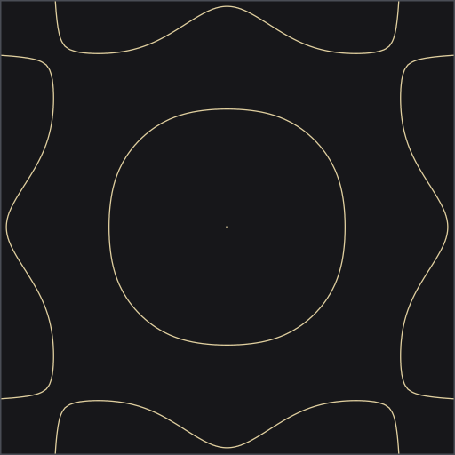

# Chladni API

Rayleigh-Ritz eigenmodes of a thin square plate, served as a REST API. Request a mode under free edge or clamped boundary conditions and get the Chladni pattern as SVG or PNG. For musicians, physics students, and anyone who wants real plate vibration modes without running a solver.

**Live at https://chladni-api.onrender.com** (free tier). The service sleeps after 15 idle minutes; the first request then takes around a minute while the container restarts and the solver runs.



Free-edge mode (m, n) = (3, 5) at about 464 Hz, sitting just under B♭4. The image is the API's own SVG output, fetched exactly like this:

```
# simplest: paste into a browser
https://chladni-api.onrender.com/render?bc=free&index=26&format=svg

# cmd or bash (quotes matter: & splits unquoted commands)
curl "https://chladni-api.onrender.com/render?bc=free&index=26&format=svg" -o chladni_464hz.svg

# PowerShell (use curl.exe, not the curl alias)
curl.exe "https://chladni-api.onrender.com/render?bc=free&index=26&format=svg" -o chladni_464hz.svg

# same mode as PNG, and every mode listed as JSON
curl "https://chladni-api.onrender.com/render?bc=free&index=26&format=png" -o chladni_464hz.png
curl "https://chladni-api.onrender.com/modes?bc=free"
``` Try `curl https://chladni-api.onrender.com/render?bc=clamped&m=2&n=1&format=svg -o cross.svg`.


Stack: Python 3.11+, FastAPI, NumPy, SciPy, pydantic, Pillow, uvicorn. Tests: pytest + httpx. Lint: ruff. CI: GitHub Actions. Package: Docker.

## What this does

Real plate eigenmodes are more involved than they look. Getting them means building the biharmonic stiffness matrix and solving a generalized eigenvalue problem, the kind of thing that is easy to get slightly wrong. My chladni tuner project already did the heavy lifting, but only inside a browser app. This API offers the same physics as a small REST service, so anyone with a script or an idea can pull a mode and a rendered Chladni pattern without starting from scratch.

## System Architecture

A single FastAPI process owns the solve. Rayleigh-Ritz assembly runs once per boundary condition at startup and is cached in memory for the life of the process. Rendering extracts the zero contour with marching squares and emits SVG or PNG.

```
┌──────────────────┐      ┌────────────────────────────────────────────────┐
│ HTTP client      │      │ chladni-api (FastAPI, in-process cache)         │
│ curl / /docs /   │      │                                                │
│ scripts          │─────▶│  /modes  /modes/{index}                        │
└──────────────────┘      │    ranked list or one mode + coefficients      │
                          │  /render                                       │
                          │    resolve (index | m,n)                       │
                          │    field grid ──▶ marching squares (zero       │
                          │                    contour)                     │
                          │    ┌─────────────┐  ┌────────────┐  ┌────────┐ │
                          │    │ SVG vector  │  │ PNG raster │  │ JSON   │ │
                          │    │ sand/field  │  │ (Pillow)   │  │ grid   │ │
                          │    └─────────────┘  └────────────┘  └────────┘ │
                          │                                                │
                          └───────────────────────┬────────────────────────┘
                                                  ▼
                              Rayleigh-Ritz solve (SciPy eigh)
                              K v = λ M v, 30-beam product basis
                              free: W(1/2,1/2)=0 constraint
                              clamped: clamped-clamped beams
                              15-2000 Hz window, F11 = 23 Hz
```

Modes are addressed two ways. The ranked index is the honest solver output: mode 1 is the fundamental, mode 2 the next-highest frequency, and so on. The plate theory pair (m, n) resolves to the mode whose dominant basis character matches, so `m=2&n=3` behaves like the tuner's plate notation.

## Component Choices

**FastAPI over Flask or Node.** The physics was already proven in Python (the tuner's precompute script), so the service language was decided by the solver. FastAPI was chosen over Flask for typed query validation and OpenAPI docs at /docs with zero extra work. Tradeoff: a slightly larger dependency tree than a bare Flask app.

**SciPy `eigh` for the generalized eigenproblem.** The Rayleigh-Ritz method reduces the plate PDE to `K v = λ M v` on a product basis of beam eigenfunctions. NumPy assembles the 4th-order stiffness tensor with einsum; SciPy solves it. Rejected: porting the tuner's math.js solver (slower, and re-proving the port for no gain) and serving the tuner's precomputed binary (it is stale relative to the current solver settings). Tradeoff: startup cost, roughly 1-2 seconds per boundary condition, paid once and cached.

**Marching squares for the nodal lines.** The Chladni sand style is the zero contour of the mode shape. The first version thresholded |W| below an amplitude cutoff; on the clamped fundamental that filled about 30% of the plate with sand. Rejected. Marching squares traces the actual contour, so the lines stay crisp at any zoom. Tradeoff: more vectorized edge math, but it is the only style used by both SVG and PNG.

**Dominant basis pair for (m, n) labels.** Labeling by counting nodal-line crossings failed on free-edge modes: their nodal lines are curved or diagonal, and the center constraint pin leaves sign artifacts that fake crossings. Labeling each eigenmode by its dominant beam-product pair is robust. Tradeoff: for free-edge modes the (m, n) label is approximate, and it is documented as such in the response and this README.

**Pillow only for PNG.** SVG is hand-built strings (vector, tiny, zoom-safe). PNG needs a rasterizer, so Pillow renders the gray field and draws the contour lines. Rejected: a pure-SVG-only API (cheap but useless for clients that want bitmaps) or a heavier Cairo dependency. Tradeoff: one extra runtime dependency for raster output.

**pytest + httpx + GitHub Actions.** Solver properties (orthogonality, convergence, mode counts, calibration) and endpoint contracts (status codes, media types, 404/422 paths) are locked down in 50 tests that run on every push and PR. Rejected: ad-hoc verification scripts. Tradeoff: a solver rewrite must keep the suite green, which is exactly the point.

**Docker with a health check.** A python:3.13-slim image runs uvicorn, and the container health check pings the root endpoint. Rejected: bare venv deployment instructions. Tradeoff: image build time, which is the standard price of a portable service.

## What I'd Do Differently

The free-free beam basis uses the same sigma convention as the chladni tuner reference (`σ = (cosh−cos)/(sinh−sin)`), which is only approximately orthogonal: cross terms reach about 1e-2. The modes are right and the frequencies are stable, but I would switch to the exactly orthogonal convention and regenerate the tuner's binaries so both apps share identical physics. Relatedly, the tuner's shipped modes.bin is stale (its header claims 17 beams while the current precompute runs 30); this API resolves at startup instead of trusting that file.

The marching squares field is sampled at cell centers, so nodal lines land within half a cell of their exact position. It is invisible at the 512px default and documented, but evaluating on lattice points would remove the offset entirely.

Cold starts solve twice (once per boundary condition), about 2 seconds total. Fine for a demo, but a disk cache of the eigenpairs would make restarts instant, and a precompute CLI would let deployments build the cache at image build time.

Phase 2 would add a batch renderer for all modes (nice for a gallery page), audio synthesis of each mode as a tone, and the tuner's real time mode blending over the API instead of over precomputed binaries.

## Setup / Quick Start

Requires Python 3.11+.

```
python -m venv .venv
# Windows:  .venv\Scripts\activate
# macOS/Linux: source .venv/bin/activate
pip install -e ".[dev]"
uvicorn app.main:app --port 8000
```

Open http://127.0.0.1:8000/docs for the interactive API. The first request triggers the startup solves, so give it a moment.

```
# Service metadata and mode counts
curl http://127.0.0.1:8000/

# All 93 free-edge modes (ranked, ascending frequency)
curl http://127.0.0.1:8000/modes?bc=free

# A single mode with its coefficient vector
curl http://127.0.0.1:8000/modes/4?bc=free

# Clamped mode (m,n) = (2,1) as SVG sand pattern
curl -o mode.svg "http://127.0.0.1:8000/render?bc=clamped&m=2&n=1&format=svg"

# Free-edge cross mode (ranked index 2) as PNG
curl -o cross.png "http://127.0.0.1:8000/render?bc=free&index=2&format=png"
```

Tests: `pytest -q` (50 tests, about 10 seconds, mostly the startup solves).

Docker:

```
docker compose up --build
```

Deploy note: the service runs on Render's free tier from the `render.yaml` blueprint in this repo. The image binds to `$PORT` (default 8000) and the Docker HEALTHCHECK doubles as the platform health probe against `/`.
